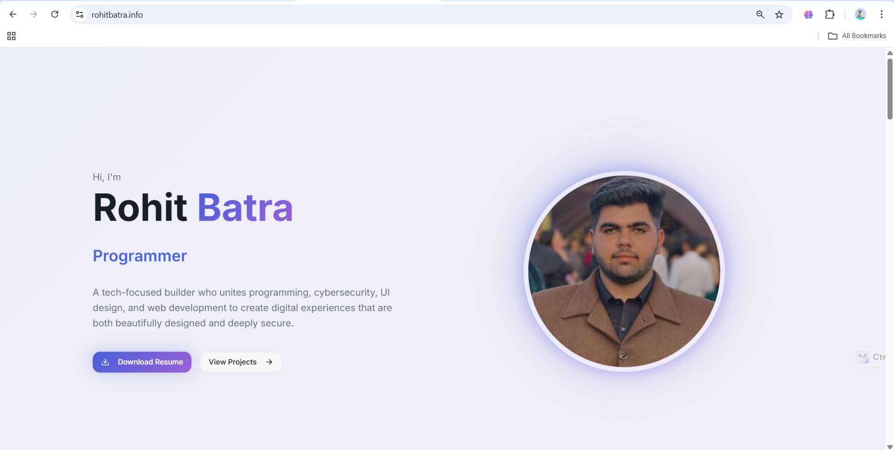
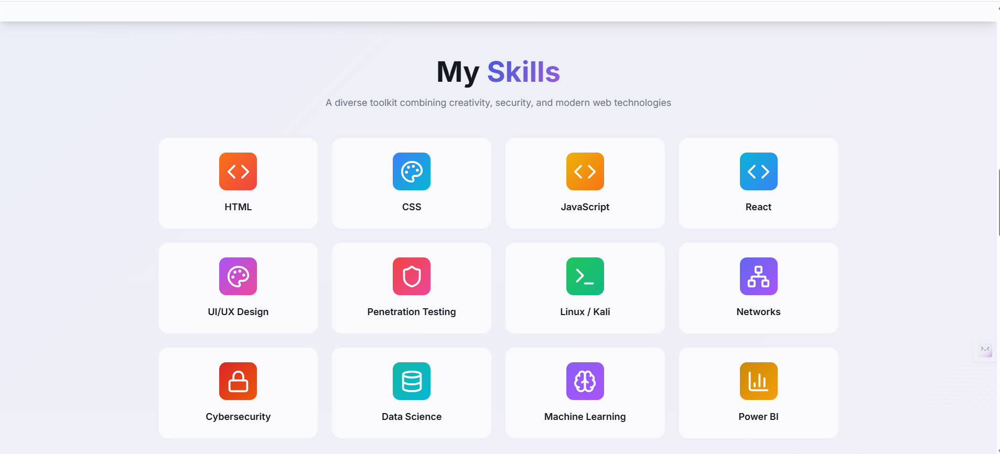
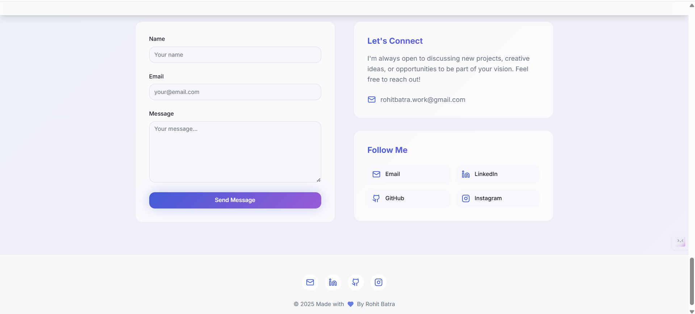

# Rohit Batra — Portfolio

A modern and responsive personal portfolio showcasing my work, skills, and experience in **programming, cybersecurity, UI/UX, and web development**.

🌍 **Live Website:** https://rohitbatra.info  
📧 **Contact:** rohitbatra.work@gmail.com  
🔗 **LinkedIn:** https://www.linkedin.com/in/irohitbatra  
🐙 **GitHub:** https://github.com/irohitbatra

---

## 🚀 Features

- Smooth scrolling & responsive UI
- Modern glass & gradient UI styling
- Projects & skills section
- Contact form with EmailJS integration
- Fully deployed on Vercel with custom domain

---

## 📸 Screenshots

### 🔹 Hero Section


### 🔹 Skills Section


### 🔹 Contact Section


---

## 🛠️ Tech Stack

- **React + TypeScript**
- **Vite**
- **Tailwind CSS**
- **ShadCN UI**
- **EmailJS**
- **Vercel Deployment**

---

## 📦 Installation

```bash
git clone https://github.com/irohitbatra/e-portfolio.git
cd e-portfolio
npm install
npm run dev
```
```bash
Made with ❤️ By Rohit Batra
